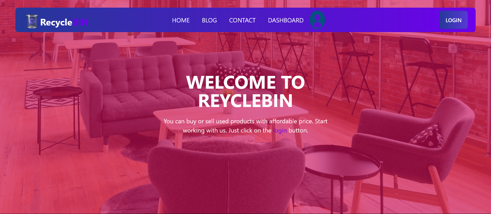

This is a responsive, fully-functional re-selling website. I created this whole website using MERN. You can see my live website on: <a href="https://recycle-bin-8fe8b.web.app/">https://recycle-bin-8fe8b.web.app/</a> 
-> I have created my website using React JS, Tailwind CSS(DaisyUI), Node JS, Express JS, MongoDB, Firebase 
-> A wonderful and responsive UI. 
-> Used great animations. 
-> Used dynamic and static data 
-> Back-end is created by Node JS, Express JS 
-> Database is created by MongoDB 
-> Used firebase to deploy 
-> Allowing customers and sellers to create an account,browse products, buy products & write reviews 
-> Admins can delete any sellers and buyers, sellers have the ability to add products, remove existing products,buyers can buy products. 
